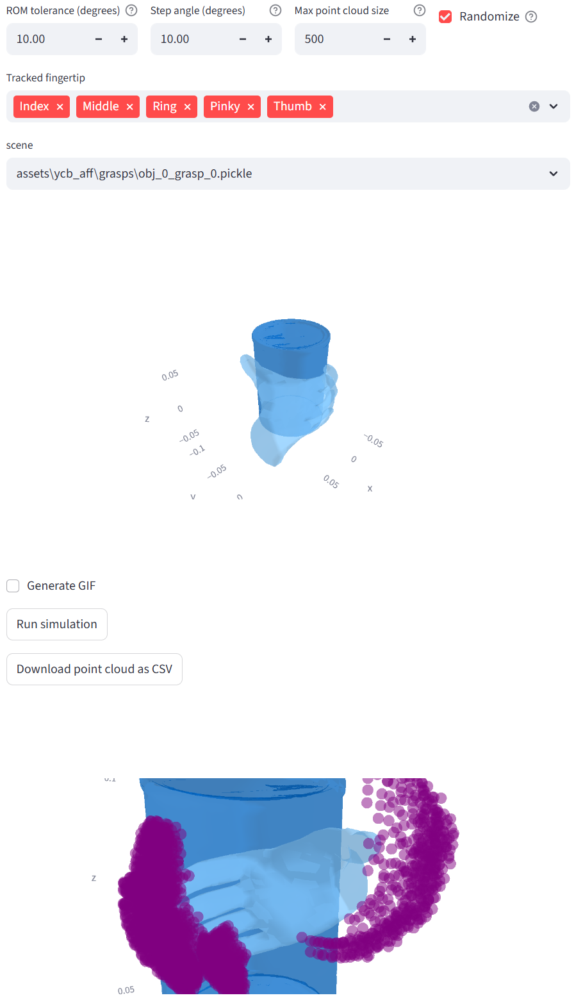
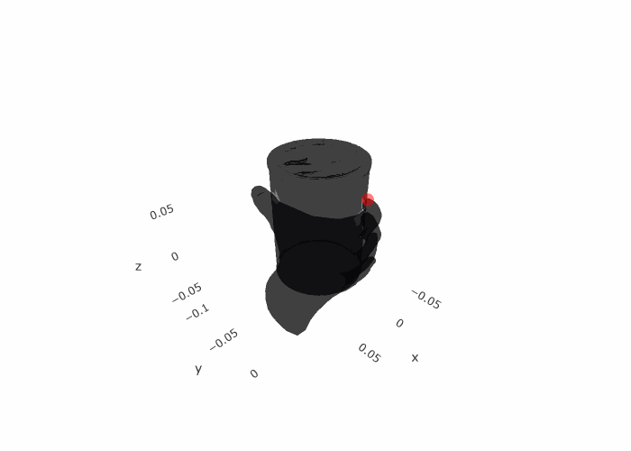

# GraV Sim

Forward kinematics simulator for grasping hand single-finger motion.

## Use as a Library
in you UV project:
```bash
uv add git+https://github.com/HAL-UCSB/grav_sim.git
uv run grav_sim verify
```
Follow the instructions on the provided in verify_assets page.

## Development Setup
from the repository root folder:
```bash
git clone https://github.com/HAL-UCSB/grav_sim.git
cd grav_sim
uv sync
uv run
uv run grav_sim verify
```
Follow the instructions on the provided in verify_assets page.

## Running

```bash
uv run grav_sim
```





## Cite

```latex
@inproceedings{10.1145/3643834.3661567,
    author = {Aponte, Alejandro and Caetano, Arthur and Luo, Yunhao and Sra, Misha},
    title = {GraV: Grasp Volume Data for the Design of One-Handed XR Interfaces},
    year = {2024},
    isbn = {9798400705830},
    publisher = {Association for Computing Machinery},
    address = {New York, NY, USA},
    url = {https://doi.org/10.1145/3643834.3661567},
    doi = {10.1145/3643834.3661567},
    booktitle = {Proceedings of the 2024 ACM Designing Interactive Systems Conference},
    pages = {151–167},
    numpages = {17},
    keywords = {dataset, extended reality, grasp-proximate interfaces, spatial user interface},
    location = {Copenhagen, Denmark},
    series = {DIS '24}
}
```